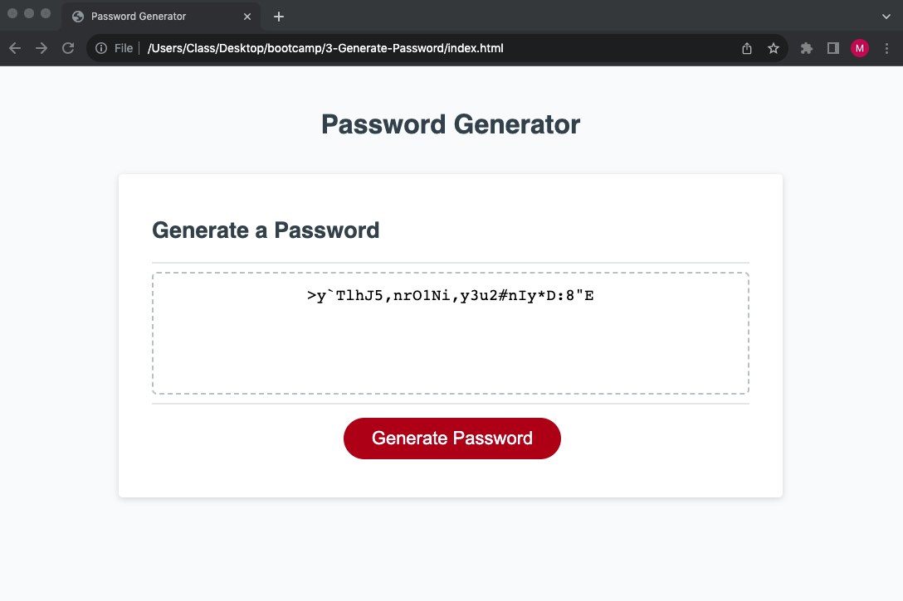

# 3-Generate-Password

## Description

This project is a random password generator that will provide a random set of characters within set parameters. This app is made with HTML, CSS, and JavaScript.

## Installation

This project can be downloaded (as a whole) and ran in Visual Studio Code with no additional modifications.

## Usage

https://m-r-urbanic.github.io/3-Generate-Password/

Open the application and click the "Generate Password" button. You will be greeted with an instruction guide. You will be prompted to choose from four different character types to make up your random password. Select 'Cancel' to deny that character type, select 'Ok' to use that type. Then put in a number between 8 and 128 to select the number of characters your password should be.

If you do not follow the instructions, you will have to restart that criteria selection phase.

## Credits

Please see links to all code referanced or used from outside sources.

JavaScript Popup Boxes, W3Schools, https://www.w3schools.com/js/js_popup.asp
JavaScript String includes(), W3Schools, https://www.w3schools.com/jsref/jsref_includes.asp
JavaScript Arrays, W3Schools, https://www.w3schools.com/js/js_arrays.asp
JavaScript Array push (), W3Schools, https://www.w3schools.com/jsref/jsref_push.asp
Get random variable with javascript, W3Schools, https://stackoverflow.com/questions/49709371/get-random-variable-with-javascript
Greater than or equal (>=), mdn_web_docs, https://developer.mozilla.org/en-US/docs/Web/JavaScript/Reference/Operators/Greater_than_or_equal
How to use JavaScript to show a confirm message, tutorialspoint, https://www.tutorialspoint.com/How-to-use-JavaScript-to-show-a-confirm-message
Password Special Characters, OWASP, https://owasp.org/www-community/password-special-characters
4 Ways to Generate Random Strings in JavaScript, SLING ACADEMY, https://www.slingacademy.com/article/ways-to-generate-random-strings-in-javascript/#:~:text=We%20can%20use%20the%20Math,using%20the%20charAt()%20function.
Converting Array to String in JavaScript, REQBIN, https://reqbin.com/code/javascript/ot8wzla9/javascript-array-to-string-example
How do I empty an array in JavaScript?, stackOverflow, https://stackoverflow.com/questions/1232040/how-do-i-empty-an-array-in-javascript

## License

MIT Liscense